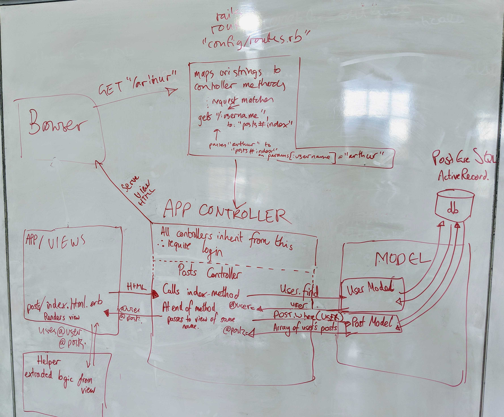
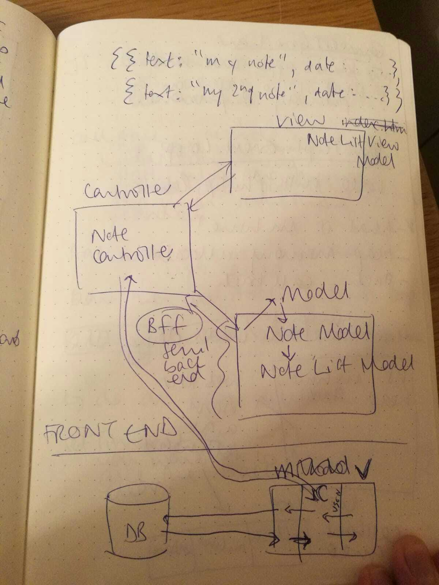

# I can make anything
## I can model anything

### Reflect: What does it mean to be able to model anything?

Two different things:
- Being able to break any complex problem or domain down so that you can understand how to implement it
- Being able to do the same so that you can communicate the idea to other people

### Plan: List evidence you aim to collect that would together show you have credibly achieved this goal

Collect diagrams from Acebook, bowling, domain modelling workshop, mvc/api diagram with Amy...

### Can you say this about yourself?

Yes

### Reflect: How does each of the following examples of your best work show evidence of achieving this goal? (e.g. Diode projects, Github repos)

Examples of models I've made:

- Acebook - we made a diagram of the Rails MVC architecture and an HTTP request/response cycle

- [Flow diagrams of bowling scoring](https://github.com/Hives/bowling-challenge/tree/master/attempt-02) - one flow diagram with high level blocks broken down into secondary flow diagrams
- [Domain modelling for MakersBnB](https://github.com/makers-bnb/makers-bnb#domain-modelling) - breaking down user stories into nouns and verbs, then a class diagram to investigate what classes and methods we would need, and how they would interact
- [Domain modelling workshop](https://github.com/Hives/makers-notes/tree/master/week-2/workshops/domain-model-diagramming-workshop#what-we-did) - simple domain broken down into class and sequence diagrams

### What feedback have you had?

I worked on this diagram of a one-page JS app with MVC architecture interacting with an API on another server with Amy. She said my contribution helped her understand the relationship between the two programs.

Jeremy said our Rails drawing helped him to understand the flow of data through our app, and the Rails MVC architecture.